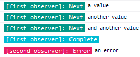

# Rxjs-Operators

This is an extension of [Rxjs](https://github.com/ReactiveX/rxjs) in order to provide more operators that are often recoded in our base code.

## debug

This operator has been inspired by this [Netanel Basal's Medium post](https://netbasal.com/creating-custom-operators-in-rxjs-32f052d69457) and by me being tired of repeating `tap(console.log)` everytime i needed to debug a stream.

`debug` is used to follow the value of a stream during it's lifecycle in the console. It is stylized and its style can be change for each lifecycle with the second parameter.

### Examples

```typescript
// With a stream in a valid state
const source$ = new Subject<string>();
const firstObserver = source$.pipe(debug("first observer")).subscribe();
source$.next("a value");
source$.next("another value");
source$.next("and another value");
source$.complete();
// With a stream in an error state
const secondObserver = throwError("an error").pipe(debug("second observer")).subscribe();
```

You will get the following result



## executeOnError

This operator has been created because we often needed to perform an action on error then rethrow or suppress it with another value.

`executOnError` is used to execute the given function whenever the stream encounter an error. By default it will rethrow the error but it is possible to suppress it and continue the stream with a default value which will be `null` by default.

It is used like this

```typescript
source$.pipe(notifyOnError(() => console.log("Oh noes")));
```

### Examples

```typescript
const source$ = new Subject<string>();
const firstObserver = source$.pipe(notifyOnError(() => console.log("Oh noes"))).subscribe();
source$.next("a value"); // Emit the value
source$.next("another value"); // Emit the value
source$.next("and another value"); // Emit the value
source$.error("Something went wrong !"); // Console has logged "Oh noes" and the stream is in error
source$.next("you there ?"); // Nothing happens
```

You can suppress the error by using it like this

```typescript
const source$ = new Subject<string>();
const firstObserver = source$
  .pipe(executeOnError(() => console.log("Oh noes"), { suppressErrors: true, defaultValue: "a default value" }))
  .subscribe();
source$.next("a value"); // Emit the value
source$.next("another value"); // Emit the value
source$.next("and another value"); // Emit the value
source$.error("Something went wrong !"); // Console has logged "Oh noes", stream is still valid and has emit "a default value"
source$.next("you there ?"); // Emit the value
```
